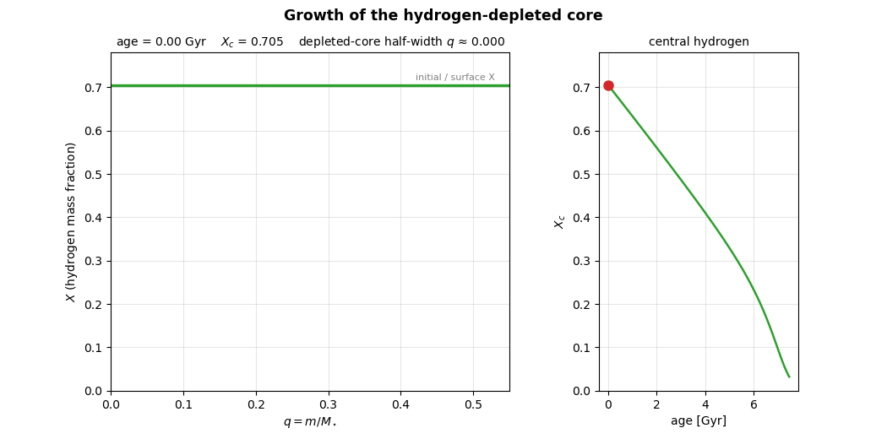

# 恒星の内部構造・進化コード (Phase A-F)

**最終更新**: 2026-07-06 / **主実装**: `stellar_structure_phase6-10.py`,
`stellar_evolution_phaseF.py`

---

## 0. 概要

Claude AIにPython でゼロから 1 次元の恒星内部構造・進化コードを書いてもらい、以下の完全な
計算パイプラインを実現した:

**一様 ZAMS の静的構造 → 非一様組成の静的太陽 → 核燃焼による時間発展 → 太陽較正**

最終成果は**較正済み標準太陽モデル**である。初期組成と混合長 (α_MLT, Y₀, Z₀) を
Newton 反復で調整し、年齢 4.57 Gyr で以下を同時に満たした:

| 量 | 本モデル | 太陽 (観測 / Model S) |
|----|---------|----------------------|
| L | 1.000 L☉ | 1.000 |
| R | 1.001 R☉ | 1.000 |
| T_eff | 5768 K | 5772 K |
| T_c | 15.68 MK | 15.6–15.7 MK |
| ρ_c | 155 g/cm³ | 152–162 |
| X_c (中心水素) | 0.365 | 0.34 |

較正パラメータ: **α_MLT = 2.20, Y₀ = 0.277, X₀ = 0.705, Z₀ = 0.0173**
((Z/X)_surf = 0.0245, GN93)。

全体像は `pipeline_overview.png` を参照。
使い方は、5.1 ファイル構成と使い方を参照。

下のアニメは、本進化コードで太陽の主系列末期にかけて水素が欠乏して行く様子を計算し可視化したもの。


---

## 1. 物理

### 1.1 構造方程式 (質量座標 q = m/M★)

4 本の 1 階常微分方程式を無次元化して解く:

- 質量保存:      dr/dm = 1/(4πr²ρ)
- 静水圧平衡:    dP/dm = −Gm/(4πr⁴)
- エネルギー:    dL/dm = ε_nuc  (主系列では ε_grav ≪ ε_nuc として無視)
- エネルギー輸送: dT/dm = −(Gm/4πr⁴)(T/P)∇,  ∇ = min(∇_rad, ∇_MLT) or ∇_ad

変数は log をとって t=log(T/T_ref), p=log(P/P_ref), S=log(r/R☉) 等に変換し、
広いダイナミックレンジを扱う。

### 1.2 状態方程式 (EOS)

理想気体 + 輻射圧 + **Saha 電離** (水素、ヘリウム I/II)。
- 完全電離領域 (深部): μ = 1/(2X + 0.75Y + 0.5Z)、∇_ad は β=P_gas/P から解析式。
- 部分電離領域 (外層 logT ≲ 5.5): Saha 方程式で電離度を解き、μ と ∇_ad を評価。
- 【Phase A-C の教訓】旧コードは部分電離の ∇_ad 低下を手動 Gaussian 6 本で
  模倣していた。Saha EOS の正常採用でこれを全廃 (人工調整ゼロ)。

### 1.3 核反応 (K&W 2012)

- pp チェーン:  ε_pp ∝ ρ X² T₆^(−2/3) exp(−33.81 T₆^(−1/3)) · g₁₁
- CNO サイクル: ε_CNO ∝ ρ X X_CNO T₆^(−2/3) exp(−152.31 T₆^(−1/3)) · g₁₄,₁
- 【Phase A の修正】旧実装は CNO の T₉→T₆ 換算 (×100) を落としており CNO が
  100 倍過小だった。較正係数なし (PP_CALIB=CNO_CALIB=1) で太陽光度が再現される
  ことを要請。

### 1.4 不透明度

- **OPAL96 GN93hz** テーブル (logT ≥ 3.75、X・Z 補間)。
- **Ferguson et al. 2005** 低温テーブル (GS98, logT 2.70–4.50) を logT=4.00±0.05 で
  C¹ smoothstep ブレンド (Phase D)。K・M 型光球 (logT<3.75) がテーブル範囲内に。
- 非一様組成では OPAL を X アンカー間で点別線形補間 (Phase E)。
- フォールバック: κ_es + Kramers(高温抑制) + H⁻。**使用中の opacity 源を毎回
  ログ表示** (Phase D-0: パスのハードコードによる黙ったフォールバックの再発防止)。

### 1.5 混合長理論 (MLT)

- **完全立方方程式** (K&W §7): η³+(8U/9)(η²+2Uη−W)=0 を桁落ちしない
  ベクトル化二分法で解く共通ソルバー `_mlt_cubic_eta` (Phase D)。
- 効率極限 U→0 で ∇→∇_ad、非効率極限 U→∞ で ∇→∇_rad を自動再現。
- 【Phase D の修正】旧・弱対流近似は効率対流極限で ∇→∇_rad を返す実装バグ
  (極限逆転) を持ち、表面対流層を消していた。

### 1.6 組成 (一様 / 非一様)

- ZAMS: X, Y, Z グローバル定数 (化学的に一様)。
- 現在の太陽: X(q), Z(q) の非一様プロファイル (Phase E)。μ(q), ε(q, X), κ(q, X)
  を位置ごとに評価。`_comp_at(q)` が補間して返す。

---

## 2. 数値解法

### 2.1 Henyey 型緩和法

質量座標 q でメッシュを切り、4 本の方程式を有限差分化して残差ベクトルを構成、
trust-region 反射法 (scipy `least_squares`, `trf`+`lsmr`) で解く。中心・表面の
境界条件を残差に組み込む。

### 2.2 fitting-point 法 + エンベロープ積分

外層 (光球〜対流エンベロープ) は別途 ODE 積分し、内部の緩和解と fitting 点で
接続。`EnvelopeTable` が (log R, log L) 格子上の双線形補間キャッシュを持ち、
ヤコビアン評価中の反復 ODE 積分を回避 (性能上重要)。

### 2.3 prior と「素の物理解」

Hayashi 偽解の抑制と収束補助のため L・R の弱い prior を課すが、Phase E で
**prior を切っても物理残差が不変 (差 0)** であることを確認済み。収束解は
prior に依存しない素の物理解 (`verify_prior_removal.py`)。

### 2.4 進化の高速化 (warm start)

時間発展では前ステップの収束解を初期値に使い、各ステップ ~60 nfev (~40 s)、
|res|∞~1e-8 で収束。コールドスタート (400 nfev, ~215 s) の 1/5 の時間。

---

## 3. Phase 別 開発史

| Phase | 内容 | 主な成果・修正 |
|-------|------|--------------|
| A–C | 物理と緩和法の確立 | Gaussian 6 本チューニング全廃 (Saha EOS)、CNO ×100 修正、fitting 法、T_c≈15.7 MK |
| D | 物理の精密化 | 低温 opacity (Ferguson05) ブレンド、完全 MLT 立方方程式、弱対流近似バグ修正、opacity パスのハードコード修正 |
| E | 非一様組成 + 静的太陽 | X(q) プロファイル機能、Model S X(q) で静的現在太陽を再現、prior 除去テスト |
| F | 進化 + 較正 | 核燃焼 dX/dt + 対流混合、時間発展ループ、太陽較正 (Newton) |

### Phase D 詳細
- D-0: `opal_table` 絶対パスのハードコード修正 (黙ったフォールバック防止)
- D-1: Ferguson et al. 2005 低温 opacity (`F05_lowT_g98.dat`, 155 テーブル)
- D-2: 完全 MLT 共通ソルバー化 (3 経路統一)

### Phase E 詳細
- 物理関数を組成対応化 (`density_from_PT`, `energy_generation`, `opacity`, `nabla_ad`)
- Model S (Christensen-Dalsgaard 1996) FGONG から X(q), Z(q) を抽出 → `modelS_Xq.dat`
- 静的現在太陽: T_c=15.78 MK, ρ_c=163.6, L=0.9987, R=1.0001, ∫εdm/L=1.0004

### Phase F 詳細
- dX/dt = −(ε_pp/E_pp + ε_CNO/E_CNO), E_H = Q/(4m_H), Q_pp=26.2 / Q_CNO=25.0 MeV
- 対流領域を質量加重平均で瞬時混合。Z 不変。ε_grav 無視 (主系列で |ε_grav|/ε≲1e-3)
- 太陽較正: (Z/X)_surf を代数的に固定し (α, Y₀) の 2×2 弦 Newton。~5 発展 (~4 h) で収束

---

## 4. 検証結果

### 4.1 ZAMS 多質量ベンチマーク (Phase D/E)

| M/M☉ | R/R☉ | L/L☉ | T_eff | T_c | 対流構造 |
|------|------|------|-------|------|----------|
| 0.3 | 0.332 | 0.0032 | 2381 | 6.0 | 深い対流エンベロープ + 放射コア※ |
| 0.8 | 0.728 | 0.295 | 4983 | 11.7 | 表面 CZ (質量 3.2%) |
| 1.0 | 0.870 | 0.720 | 5698 | 13.5 | 表面 CZ 底 r/R*=0.82 |
| 1.5 | 1.203 | 3.65 | 7270 | 17.8 | 対流コア q≈0.010 + 表面対流なし |
| 2.0 | 1.515 | 11.5 | 8641 | 20.6 | 対流コア q≈0.072 + 表面対流なし |

全質量で ∫εdm/L = 1.000 ± 0.001。
※ M=0.3 が完全対流にならないのは EOS に電子縮退圧がないため (§6)。

### 4.2 静的現在太陽 (Model S X(q), Phase E)

L=0.9987, R=1.0001, T_eff=5768 K, **T_c=15.78 MK**, ρ_c=163.6, ∫εdm/L=1.0004,
放射コア。μ 勾配 (中心 0.857→表面 0.60) が T_c を ZAMS の 13.5 MK から現在の
15.78 MK へ正しく押し上げることを実証。

### 4.3 較正済み標準太陽モデル (Phase F, 最終成果)

較正 Newton は 2 反復 (計 5 発展, 3.98 h) で |F|=1.2e-3 に収束:

| it | α | Y₀ | L | R | T_c |
|----|-----|------|------|------|------|
| 0 | 1.800 | 0.2800 | 1.0159 | 1.0463 | 15.77 |
| 1 | 2.149 | 0.2774 | 0.9995 | 1.0059 | 15.68 |
| 2 | 2.200 | 0.2773 | 1.0003 | 1.0012 | 15.68 |

主系列進化の全ての向きが正しい: 年齢とともに X_c 減少、L 増加、T_c 上昇、
R 膨張。図 `phaseF_calibrated.png` 参照。

### 4.4 回帰・整合性テスト

- `verify_phase_d.py`: MLT 立方方程式が brentq と <5e-16 一致、opacity ブレンド連続。合格。
- `verify_prior_removal.py`: prior ON/OFF で物理残差の差 0。合格。
- 一様組成経路は Phase E の改修後も不変 (太陽光球 κ=0.40 cm²/g)。

---

## 5. ファイル構成と使い方

### 5.1 主要ファイル

下の表の上から5個のファイルを同じディレクトリに置けば動くはずです。

| ファイル | 役割 |
|---------|------|
| `stellar_structure_phase6-10.py` | 静的構造ソルバー (ZAMS / 非一様組成) |
| `stellar_evolution_phaseF.py` | 進化エンジン + 太陽較正 (上を再利用) |
| `GN93hz.dat` | OPAL96 opacity テーブル |
| `F05_lowT_g98.dat` | Ferguson 2005 低温 opacity (155 テーブル) |
| `modelS_Xq.dat` | Model S の X(q), Z(q) (静的太陽の入力) |
| `verify_phase_d.py` / `verify_phase_e.py` / `verify_prior_removal.py` | 検証 |
| `finalize_solution.py` | チェックポイントから診断+テーブル復元 |

### 5.2 代表的なコマンド

```bash
# ZAMS 静的モデル (質量指定)
python3 stellar_structure_phase6-10.py --fitting --M 1.0 --table-out l

# 非一様組成の静的現在太陽 (Model S X(q))
python3 stellar_structure_phase6-10.py --fitting --M 1.0 \
        --comp-profile modelS_Xq.dat --table-out l

# 主系列進化 (ZAMS → 4.57 Gyr, トラック自動保存)
python3 stellar_evolution_phaseF.py --evolve --age-gyr 4.57 --n-steps 60 \
        --save-profiles phaseF_profiles.npz

# 太陽較正 (alpha, Y0, Z0 を L=R=1 に合わせる)
python3 stellar_evolution_phaseF.py --calibrate --newton-steps 4
```

### 5.3 出力

- `*_track.txt`: 1 ステップ 1 行 (age, X_c, X_surf, R, L, T_eff, T_c, ρ_c,
  r_cz/R*, q_core, nfev, |res|∞)
- `*_calib.txt`: 較正 Newton 履歴
- `*_evolved.npz` / `*_profiles.npz`: 最終 X(q) / 各ステップの構造プロファイル

### 5.4 運用上の注意

- 構造ファイルはロード時に自動検出 (環境変数 `SS_STRUCTURE_FILE` →
  `--structure-file` → phase 番号最大の Phase E 対応版)。リネーム耐性あり。
- 長時間ランは第1段チェックポイント (`ph6_fit_sol.npz`) を保存。中断時は
  `finalize_solution.py` で再ソルブなしに成果物を復元可能。

---

## 6. 既知の限界と今後 (Phase G: 元素拡散)

較正済み太陽モデルに残る 3 つの ~5% 級のずれは、**すべて元素拡散
(microscopic diffusion, 重力沈降) を入れていないことの既知のシグネチャ**で
あり、相互に整合している:

1. **r_cz/R* = 0.752 vs 観測 0.713**: He が対流層底の下に沈殿して不透明度を
   上げ対流層を深くする効果を欠く。無拡散 SSM が 0.73–0.75 に留まるのは典型。
2. **Z₀ = 0.0173 vs 拡散込 SSM の ~0.0196**: 無拡散では (Z/X)_surf=Z₀/X₀ が
   不変なので、観測 0.0245 に合わせると初期 Z₀ が低く出る。差が拡散の寄与分。
3. **X_c = 0.365 vs Model S 0.34**: Z₀ がやや低い (不透明度低) ことと He 沈降が
   ないことの複合。

**次段階 (Phase G)**: Thoul et al. (1994) の拡散係数で He・重元素の沈降を各
タイムステップの ∂X/∂t に拡散項として追加すれば、r_cz→0.713, Z₀→0.0196,
X_c→0.34 が同時に改善し、ヘリオサイズモロジー精度の SSM に到達する見込み。
既存の時間発展ループの自然な拡張として実装できる。

その他の中期課題:
- **電子縮退 EOS**: M≲0.4 M☉ の完全対流と進化後期に必要 (M=0.3 が完全対流に
  ならない件)。
- **適応タイムステップ**: |ΔX_c|・|ΔL| に応じた Δt 調整で効率化。
- **opacity 混合の統一**: OPAL(GN93) と低温側(GS98) の数% 非整合の解消。

---

## 7. 到達点の総括

`stellar_structure_general8.py` の人工調整だらけの状態から出発し、
物理を正面から実装し直すことで、Gaussian チューニングや誤った反応率換算を
排して「素の物理解」に到達した。その上に非一様組成・核燃焼発展・太陽較正を
積み上げ、恒星進化コードの中核 (静的構造 → 進化 → 較正) を完備した。
較正済み標準太陽モデルが L=R=1、T_eff・T_c ともに観測と一致する水準で
得られており、残る精密化課題 (拡散・縮退) も実装経路が明確である。
